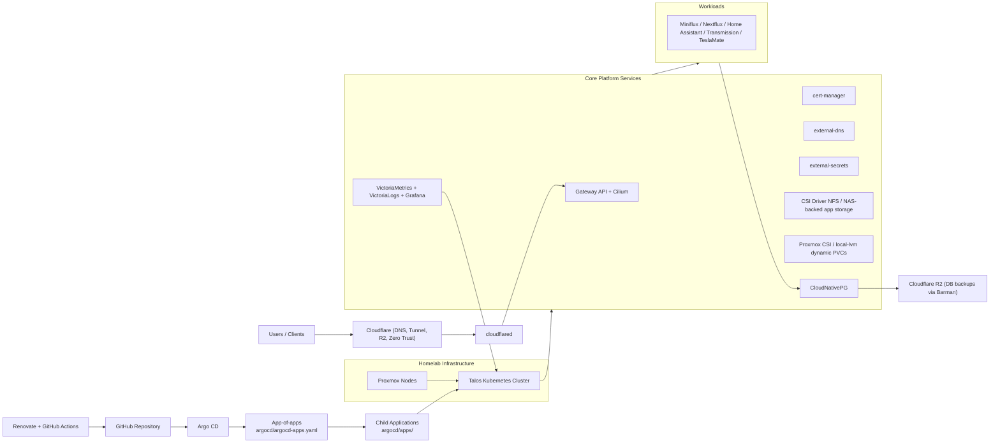

# 🏡 nidr0x Homelab

Welcome to the nidr0x Homelab repository! Here you'll find [Kubernetes](https://kubernetes.io/) manifests and [Argo CD](https://argoproj.github.io/cd/) definitions for a homelab environment, all running on top of [Talos](https://talos.dev) and [Proxmox](https://www.proxmox.com/en/). This setup includes a wide range of applications, each organized into its own folder, with versioning expertly managed by [Renovate](https://www.mend.io/renovate/).

# 🧪 Purpose

The primary goal of this repository, beyond self-hosting services on my own infrastructure, is to continuously improve my skills, experiment with new technologies and methodologies, and apply this knowledge to real-world scenarios in my professional work.

## ⚙️ Application list

This inventory follows the application definitions in [`argocd/apps/`](argocd/apps/). Argo CD itself is bootstrapped from [`argocd/`](argocd/).

- [AdGuard Home](https://github.com/AdguardTeam/AdGuardHome)
- [Argo CD](https://github.com/argoproj/argo-cd)
- [cert-manager](https://github.com/cert-manager/cert-manager)
- [Cilium](https://cilium.io/)
- [cloudflared](https://github.com/cloudflare/cloudflared)
- [CloudNativePG](https://github.com/cloudnative-pg/cloudnative-pg) (with [Barman Cloud plugin](https://github.com/cloudnative-pg/plugin-barman-cloud))
- [CSI Driver NFS](https://github.com/kubernetes-csi/csi-driver-nfs)
- [External DNS](https://github.com/kubernetes-sigs/external-dns)
- [External Secrets](https://github.com/external-secrets/external-secrets)
- [Gateway API](https://gateway-api.sigs.k8s.io/)
- [Miniflux](https://miniflux.app/)
- [Nextflux](https://github.com/electh/nextflux)
- [Home Assistant](https://github.com/home-assistant/docker)
- [Homebridge](https://homebridge.io/)
- [Kubelet Serving Cert Approver](https://github.com/alex1989hu/kubelet-serving-cert-approver)
- [Kyverno](https://kyverno.io/)
- [Metrics Server](https://github.com/kubernetes-sigs/metrics-server)
- [n8n](https://n8n.io/)
- [Node Local DNS](https://kubernetes.io/docs/tasks/administer-cluster/nodelocaldns/)
- [Node Problem Detector](https://github.com/kubernetes/node-problem-detector)
- [Proxmox CSI Plugin](https://github.com/sergelogvinov/proxmox-csi-plugin)
- [Secret Reloader](https://github.com/stakater/Reloader)
- [Spegel](https://github.com/spegel-org/spegel)
- [Talos Backup](https://github.com/siderolabs/talos-backup)
- [TeslaMate](https://github.com/teslamate-org/teslamate)
- [Transmission](https://github.com/transmission/transmission)
- [Victoria Metrics K8s Stack](https://github.com/VictoriaMetrics/helm-charts/tree/master/charts/victoria-metrics-k8s-stack)
- [VictoriaLogs](https://github.com/VictoriaMetrics/VictoriaMetrics/tree/master/app/victorialogs)
- [Wallos](https://github.com/ellite/Wallos)

## 🛠️ Changelog

Check the [commit history](https://github.com/nidr0x/k8s-gitops/commits/master)

## 🔗 External cloud dependencies

While most of my infrastructure and workloads are self-hosted I do rely upon the cloud for certain key parts of my setup. This saves me from having to worry about two things. Dealing with chicken/egg scenarios and services I critically need whether my cluster is online or not.

| Service                                    | Use                                                                                               | Cost                 |
| ------------------------------------------ | ------------------------------------------------------------------------------------------------- | -------------------- |
| [Cloudflare](https://www.cloudflare.com/)  | Domain & R2 (Database backups) & Cloudflare tunnels (exposing applications) & Oauth ( Zero Trust) | ~$10/yr              |
| [GitHub](https://www.github.com/)          | Repository & CI/CD                                                                                | Free                 |
| [Brevo](https://www.brevo.com/)            | SMTP email platform                                                                               | Free (up to 300/day) |
| [ZeroSSL](https://www.zerossl.com/)        | Issuing SSL Certificates via Cert Manager                                                         | Free                 |
| [Doppler](https://www.doppler.com/)        | Secrets management platform                                                                       | Free                 |
| [healthchecks.io](https://healthchecks.io) | Monitoring internet connectivity                                                                  | Free                 |

## 📁 Repository structure

The repository is organized into folders by application. Each folder contains the necessary manifest files to deploy the application on a Kubernetes cluster. The `argocd` folder contains files for setting up and managing ArgoCD.

## 🌐 Public Services

As part of my commitment to open-source communities, I offer these public services:

**DNS-over-HTTPS (DoH)**
🔗 `https://dns.nidr0x.win/dns-query`

It is powered by [AdGuard Home](https://github.com/AdguardTeam/AdGuardHome) + [Cloudflare](https://www.cloudflare.com). The configuration that uses is available [here](https://github.com/nidr0x/k8s-gitops/blob/master/kubernetes/main/apps/adguardhome/config/AdGuardHome.yaml)

## 🏗️ Architecture Diagram

## TO-DO

- [ ] Move data-center workloads to VLAN 3 while keeping infrastructure management and Corosync on Trusted.
- [x] Establish the VictoriaMetrics, VictoriaLogs, and Grafana observability stack with dashboards and alerts.
- [ ] Expand observability coverage with service-specific dashboards and alerts.
- [x] Converge Argo CD application management on this repository's app-of-apps.
- [ ] Simplify the Argo CD bootstrap and sync/drift configuration.
- [x] Define and deploy baseline app-scoped NetworkPolicies.
- [ ] Extend NetworkPolicy coverage to remaining workloads and validate required traffic paths.
- [x] Create an architecture diagram